# Lumen Orb Lab

A production-ready **animated voice-assistant orb** for React Native, built as a
dimensional, living **cosmic energy sphere** - not a flat 2D graphic. Seven
behavioral states, smooth blended transitions, and real-time audio reactivity,
wrapped in a small demo harness (state triggers, a mock amplitude generator, a
transition tuner, and performance settings).

Expo / React Native + TypeScript, rendered with `@shopify/react-native-skia`.
Runs on iOS and Android from one codebase.

## Demo

| iOS | Android |
|---|---|
| 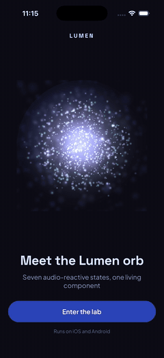 | 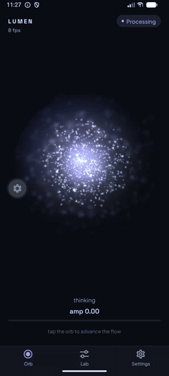 |

Same codebase running on both platforms.

## Screens

| | | |
|---|---|---|
| 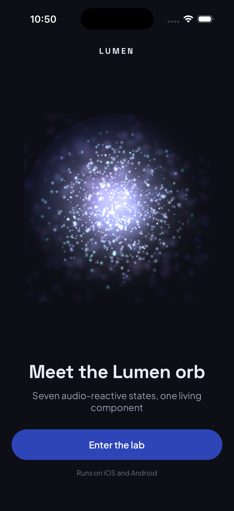 | 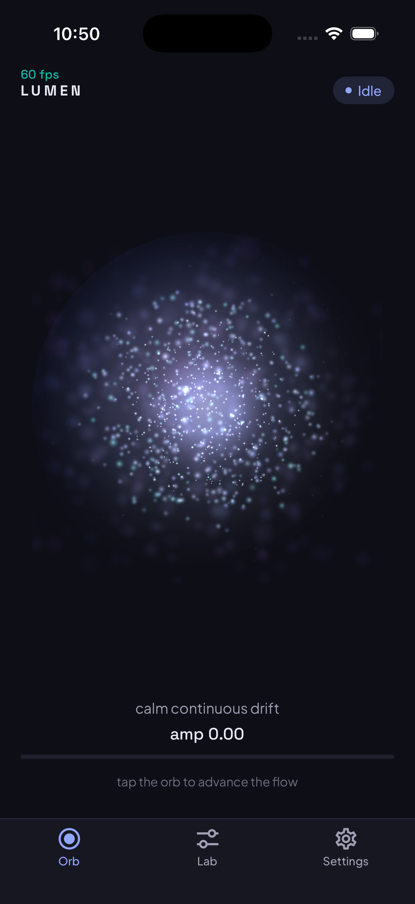 | 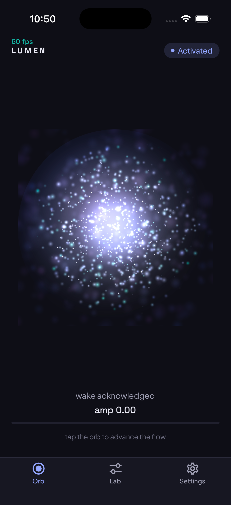 |
| Onboarding | Idle | Activated |
| 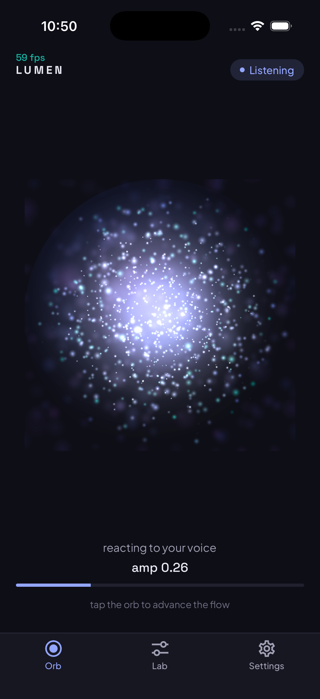 | 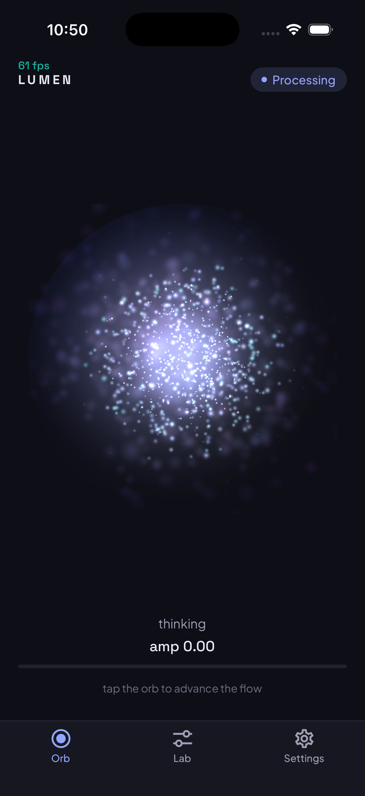 | 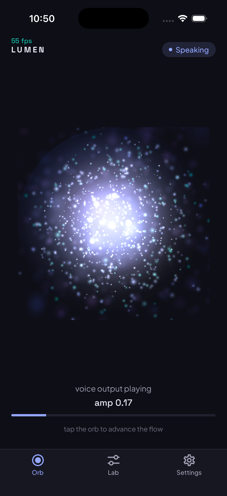 |
| Listening (audio-reactive) | Processing | Speaking (audio-reactive) |
| 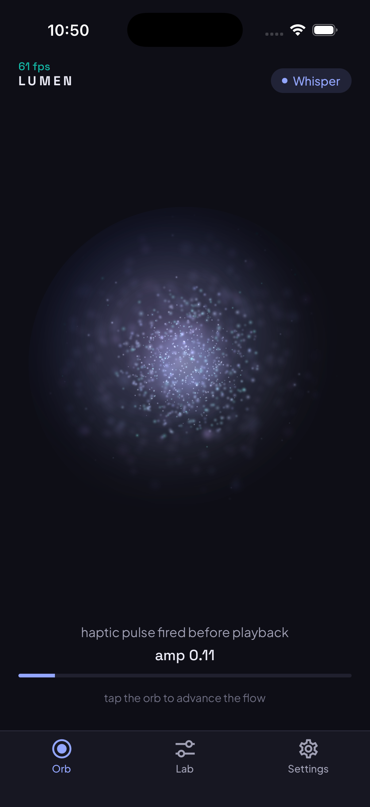 | 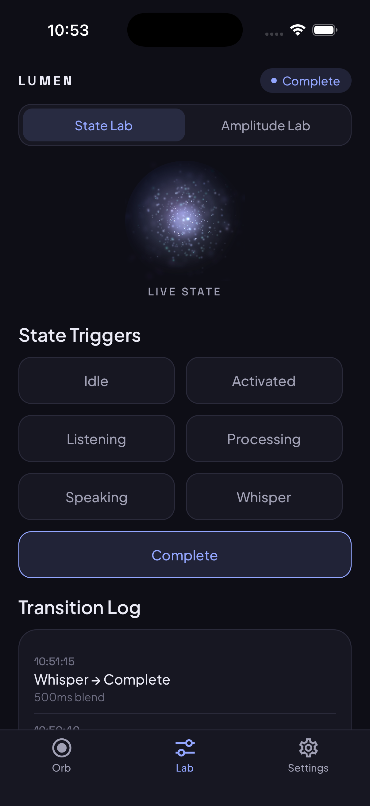 | 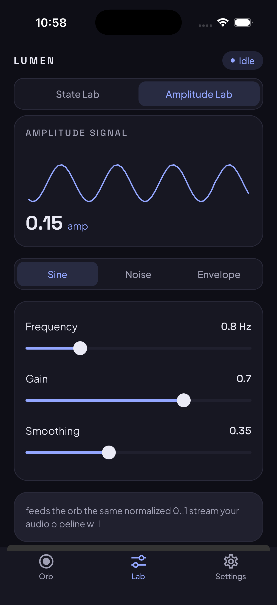 |
| Whisper (+ haptic) | State Lab | Amplitude Lab |
| 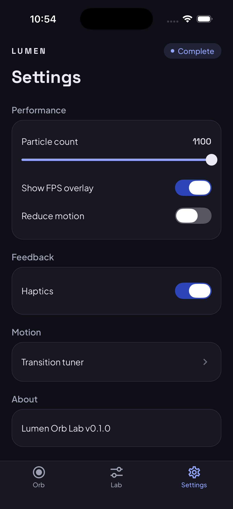 | 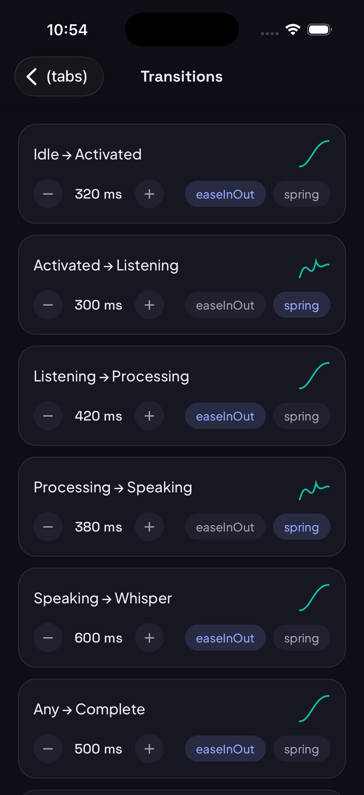 | |
| Settings | Transition tuner | |

## What it shows

- **A 3D-feeling orb, not a 2D orb.** The orb is a particle sphere drawn in
  three depth layers - far (large, soft, slow, blurred), mid, and near (small,
  sharp, fast) - so the layers slide past each other and create real parallax.
  A starfield backdrop, a violet nebula, and a soft living core sit behind and
  inside it, and the whole cloud rotates on a tilted axis with subtle inner
  turbulence.
- **Seven states, blended not swapped.** Idle, Activated, Listening, Processing,
  Speaking, Whisper, and Completion. Each state is a target vector of visual
  parameters; on a state change the renderer eases every parameter toward its
  new target, so states cross-fade instead of hard-cutting between loops.
- **Audio-reactive.** A normalized `0..1` amplitude signal pulses the shell and
  core every frame. Listening reacts to (mock) mic level; Speaking reacts to
  (mock) TTS level.
- **Whisper + haptics.** The whisper state is a restrained, dimmer animation and
  fires a brief haptic pulse just before the whispered response.
- **Demo harness.** Trigger any state and watch blended transitions logged live;
  shape the mock audio (sine / noise / envelope with frequency, gain, smoothing);
  tune each transition's duration and easing curve; adjust particle count, FPS
  overlay, haptics, and reduce-motion.

## Integration API

The orb is one reusable component. Drive it with a `state` and a normalized
`0..1` amplitude shared value:

```tsx
<VoiceOrb
  state={orbState}          // 'idle' | 'listening' | 'speaking' | ...
  amplitude={amplitude}     // Reanimated SharedValue<number>, 0..1
  transitions={transitions} // per-transition duration + easing
/>
```

A mock generator feeds `amplitude` in this demo; a real app swaps it for mic
RMS (Listening) or TTS output level (Speaking) on the same signal - no change to
the orb internals.

## Architecture

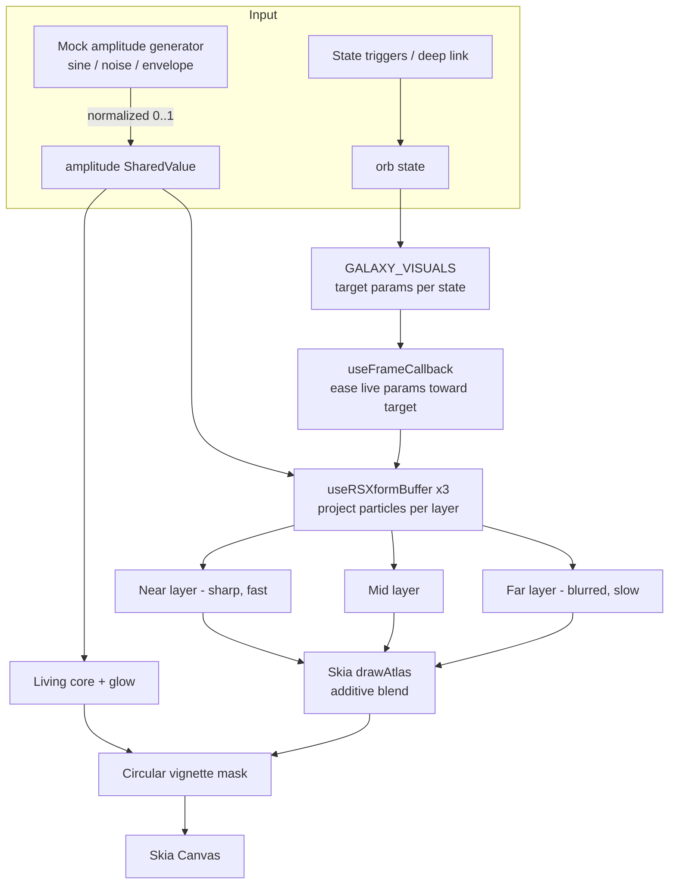

- `src/components/VoiceOrb.tsx` - the orb renderer (three Atlas layers, blur,
  mask, core; per-frame projection worklets on the UI thread).
- `src/orbStates.ts` - the seven states, per-state visual target vectors, and
  the default transition table.
- `src/store.ts` - Zustand store (current state, transition log, mock-audio
  config, transition specs, performance settings).
- `src/amplitude.ts` - the mock normalized-amplitude generator (worklet).
- `app/` - Expo Router screens: onboarding, `(tabs)` Orb / Lab / Settings, and a
  Transitions modal.

## Run

```sh
npm install
npx expo start
# then open in Expo Go on iOS/Android, or:
npx expo run:ios
npx expo run:android
```

## Tech stack

Expo / React Native, TypeScript, `@shopify/react-native-skia` (drawAtlas, Blur,
Mask, RadialGradient), `react-native-reanimated` (UI-thread worklets, RSXform
buffers, clock), Expo Router, Zustand, `expo-haptics`. Fonts: Plus Jakarta Sans
and Space Grotesk.
